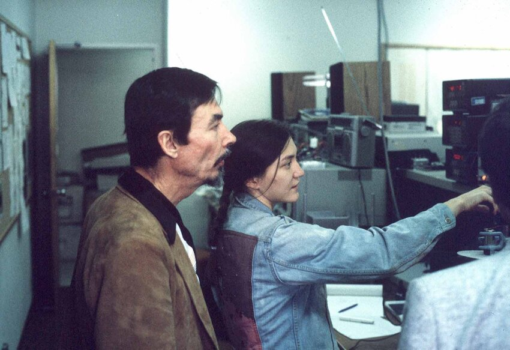
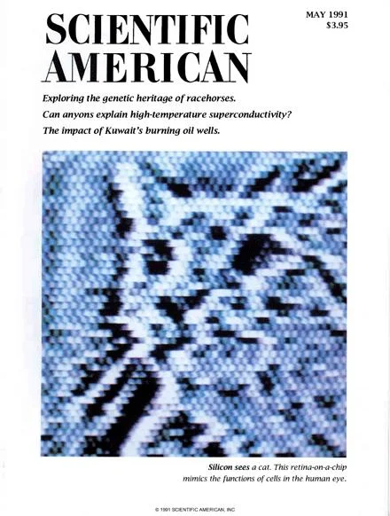
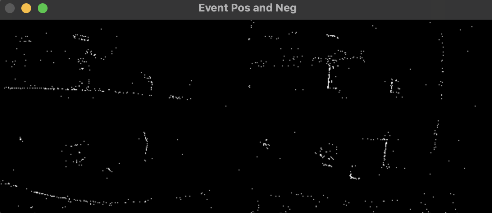
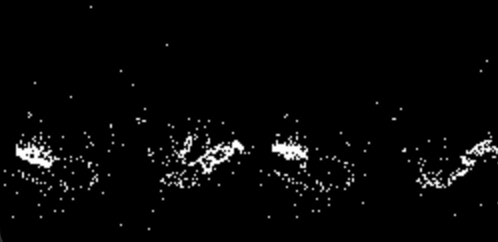
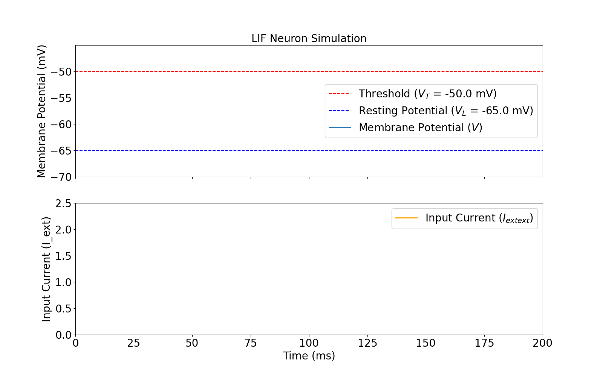
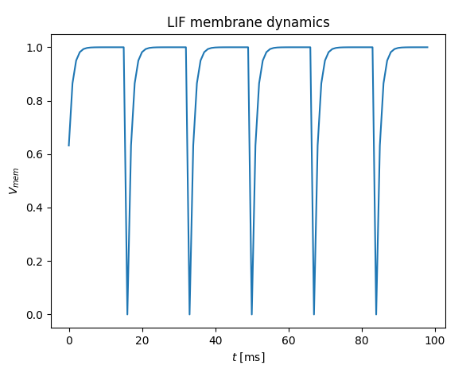
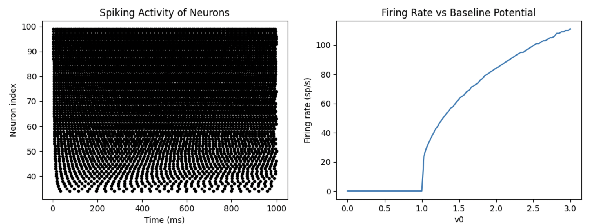
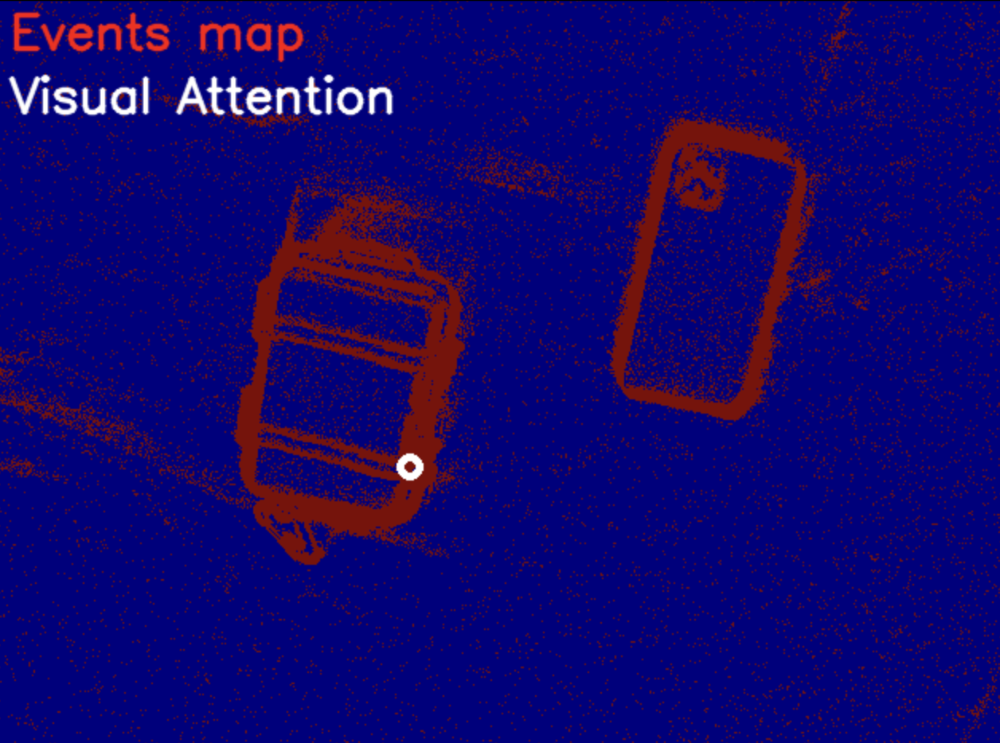
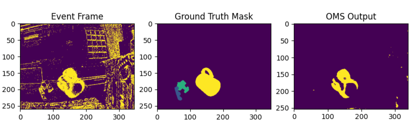

# CTU: Event-driven sensing and Neuromorphic computing

## Introduction 

Robotics is entering a new era of intelligence, where traditional approaches to perception 
and computation are no longer sufficient to meet the demands of real-time, energy-efficient,
and adaptive systems. To enable more complex behaviours and facilitate the seamless integration 
of robots into daily human environments, it is imperative to significantly reduce the power 
consumption of robotic applications.

Event-driven sensing and neuromorphic computing offer disruptive solutions to these challenges 
by mimicking how biological brains perceive and process their surroundings, a critical step toward
the next generation of robotic autonomy. Unlike conventional systems that process data at fixed
intervals, event-driven systems react only when a change occurs in the environment. 
Event-driven sensing encompasses a range of event-based sensors for [vision](https://www.prophesee.ai/event-based-sensor-imx636-sony-prophesee/), 
[audio](https://link.springer.com/referenceworkentry/10.1007/978-1-4614-7320-6_118-1), and [touch](https://link.springer.com/referenceworkentry/10.1007/978-981-16-5540-1_117), 
seamlessly integrating with neuromorphic platforms ([SpiNNaker](https://www.humanbrainproject.eu/en/collaborate-hbp/innovation-industry/technology-catalogue/spinnaker/),
[Speck](https://www.synsense.ai/products/speck-2/), [BrainScaleS](https://brainscales.kip.uni-heidelberg.de/), [Loihi](https://www.intel.com/content/www/us/en/research/neuromorphic-computing.html), [Akida](https://brainchip.com/akida-neural-processor-soc/)) 
to enable the construction of spiking neural networks for efficient computation.
This shift enables low-latency, low-power, and highly efficient processing, essential for autonomous
robots, smart city infrastructure, and space exploration — fields where quick adaptation, energy 
efficiency, and data reduction are key.

Event-based information processing has gained significant [attention](https://www.eetimes.com/what-does-neuromorphic-mean-today/) from the scientific community 
(and worldwide media such as [EE Times](https://www.eetimes.com/tag/neuromorphic/)) due to the promising results of early studies at 
[Caltech University in the late 1980s](http://www.carvermead.caltech.edu/). The concept of neuromorphic computing has evolved, with its meaning changing 
based on the level of emulation of neuron dynamics. This technology has attracted interest because 
of the fundamental belief that nature and biology possess superior characteristics for solving daily
tasks. 

## A Bit of History  

### Carver Mead  

[Carver Mead](http://www.carvermead.caltech.edu/), a professor at Caltech, is widely recognized as the founder of neuromorphic engineering. In the late 1980s, he introduced the concept of using analog VLSI circuits to mimic neuro-biological architectures present in the nervous system. His seminal work, *A Silicon Model of Early Visual Processing*, co-authored with Misha Mahowald in 1988, demonstrated the potential of silicon-based neural systems. In 2024, Mead was honored with a lifetime contribution award by the Misha Mahowald Prize committee for his foundational work in the field.  
[Read more at Caltech](https://www.caltech.edu/about/news/carver-mead-earns-lifetime-contribution-award-for-neuromorphic-engineering/)  

### Video:

### Misha Mahowald  

[Misha Mahowald](https://direct.mit.edu/neco/article/35/3/343/113812/Neuromorphic-Engineering-In-Memory-of-Misha), one of Mead's doctoral students, made significant contributions to neuromorphic engineering. She developed the first silicon retina, an analog VLSI system that emulated the early visual processing of the human retina. Her groundbreaking work in the early 1990s on a silicon model of stereoscopic vision provided a foundation for future neuromorphic vision systems. In her honor, the Misha Mahowald Prize was established to recognize outstanding achievements in neuromorphic engineering.  

### Video:

### Tobi Delbruck  

[Tobi Delbruck](https://www.eetimes.com/podcasts/tobi-delbruck-talks-caltech-cameras-and-neural-control/) is a professor at the Institute of Neuroinformatics at the University of Zurich and ETH Zurich. He has played a crucial role in advancing neuromorphic engineering, particularly in the development of event-based vision sensors. Collaborating with Mead and Mahowald, Delbruck has contributed significantly to silicon retinas and event-driven cameras, shaping the design of modern low-latency, low-power vision systems.  

### Video:

### Giacomo Indiveri  

[Giacomo Indiveri](https://ee.ethz.ch/the-department/people-a-z/person-detail.Nzk0NzU=.TGlzdC8zMjc5LC0xNjUwNTg5ODIw.html) is a professor at the Institute of Neuroinformatics at the University of Zurich and ETH Zurich. He is a prominent figure in neuromorphic engineering, making significant advancements in the development of bio-inspired computational architectures. His research focuses on creating hardware that mimics the brain's neural processes, particularly in sensory processing and perception. Indiveri has been instrumental in designing neuromorphic chips and systems capable of real-time processing of sensory data, which has important implications for robotics and artificial intelligence. His contributions have fostered collaboration across disciplines, further advancing the field of neuromorphic computing.

### Video:

## Key Figures in Neuromorphic Engineering  

Here is a list of pioneers and leading researchers in the field of neuromorphic computing along with their affiliations:  

- **Carver Mead** – Professor Emeritus, California Institute of Technology ([Caltech](https://www.caltech.edu/))  
- **Misha Mahowald** – Former researcher, California Institute of Technology  
- **Tobi Delbruck** – Professor, Institute of Neuroinformatics, University of Zurich & ETH Zurich ([INI Zurich](https://www.ini.uzh.ch/))  
- **Kwabena Boahen** – Professor, Stanford University ([Stanford Brains in Silicon](https://web.stanford.edu/group/brainsinsilicon/))  
- **Giacomo Indiveri** – Professor, Institute of Neuroinformatics, University of Zurich & ETH Zurich ([INI Zurich](https://www.ini.uzh.ch/))  
- **Shih-Chii Liu** – Professor, Institute of Neuroinformatics, University of Zurich & ETH Zurich ([INI Zurich](https://www.ini.uzh.ch/))  
- **Steve Furber** – Professor, University of Manchester, leader of SpiNNaker project ([SpiNNaker](https://www.cs.manchester.ac.uk/research/expertise/neuromorphic-computing/))  
- **Karlheinz Meier** (1955–2018) – Physicist and co-founder of neuromorphic hardware projects ([BrainScaleS](https://brainscales.kip.uni-heidelberg.de/))  
- **Chris Eliasmith** – Director of the Centre for Theoretical Neuroscience, University of Waterloo ([Waterloo CTN](https://uwaterloo.ca/))  

This tutorial provides an introduction to event-driven sensing and neuromorphic computing, highlighting its historical origins and key contributors. The field continues to evolve, driving advancements in robotics, artificial intelligence, and low-power computing for real-world applications. 

## What Are Event-Based Cameras?

Unlike traditional cameras that capture full frames at fixed intervals—such
as 30 or 60 frames per second—**event-based cameras** operate on a 
fundamentally different principle. These innovative cameras are 
engineered to detect and record **changes** in the scene on a pixel-by-pixel
basis. Instead of capturing a complete image of the entire scene at once, 
they only respond to what *moves* or *changes* in brightness, providing a
more dynamic representation of the visual environment.

In an event-based camera, each pixel functions independently. This means
that when a pixel detects a change in brightness—whether due to motion, 
lighting shifts, or other factors—it reacts immediately. Upon detecting a 
change, the pixel emits an **event** instead of a traditional frame. This
event contains information about the time and location of the change. As a
result, static areas of the scene do not generate events, leading to a 
significant reduction in the amount of data collected. This characteristic
is particularly advantageous for conserving **memory** and **energy**.

Event-based cameras are notable for their ultra-fast response time. They
capture changes as they occur, enabling real-time processing with virtually
no delay. This rapid response is crucial for applications that require 
immediate feedback. Additionally, by focusing only on relevant changes in
the scene, event-based cameras collect significantly less information than
traditional cameras, making them highly efficient and suitable for devices
with limited processing power and storage capacity.

These cameras excel at capturing rapid movements, making them ideal
for scenarios such as sports, aerial drones in flight, and autonomous
vehicles navigating complex environments. Their ability to track fast-moving 
objects with precision sets them apart from conventional imaging systems,
allowing for more advanced applications in robotics and beyond.

  
*Copyright for the GIF: Arren Glover, Italian Institute of Technology*

Event-based cameras[1], which mimic the initial 
layers of the mammalian retina and react to pixel-level illumination 
changes, offer a solution to the limitations of the frame-based cameras. 
Unlike frame-based cameras, event-based sensors improve dynamic range,
reduce latency, and generate an
asynchronous event stream providing information of spatial coordinates, 
polarity, and timestamps. This results in a significant reduction in data
processing, making event-based cameras highly relevant for robotic 
applications[2,3,4,5]. 
Their inherent real-time response to luminance changes provides 
an ideal sensory input for guiding subsequent visual attention actions.

### References: 
- [1] Lichtsteiner, P., Posch, C., & Delbruck, T. (2008). A 128x128 120dB 15us Latency Asynchronous Temporal Contrast Vision Sensor. IEEE Journal of Solid-State Circuits, 43(2), 566-576.**
- [2] Monforte, Marco, et al. "Exploiting event cameras for spatio-temporal prediction of fast-changing trajectories." 2020 2nd IEEE International Conference on Artificial Intelligence Circuits and Systems (AICAS). IEEE, 2020.
- [3] Mueggler, Elias, et al. "Continuous-time visual-inertial odometry for event cameras." IEEE Transactions on Robotics 34.6 (2018): 1425-1440.
- [4] Iacono, Massimiliano, et al. "Towards event-driven object detection with off-the-shelf deep learning." 2018 IEEE/RSJ International Conference on Intelligent Robots and Systems (IROS). IEEE, 2018.
- [5] Glover, Arren, and Chiara Bartolozzi. "Robust visual tracking with a freely-moving event camera." 2017 IEEE/RSJ International Conference on Intelligent Robots and Systems (IROS). IEEE, 2017.
- [6] Bartolozzi, Chiara, et al. "Embedded neuromorphic vision for humanoid robots." CVPR 2011 workshops. IEEE, 2011.

  

If you want to know more about the history and advancements in neuromorphic 
engineering and event-based sensing, check out the ["Brains and Machines"](https://brainsandmachines.net/) 
podcast.  This podcast delves into the intersection of neuroscience, robotics, and artificial intelligence, featuring discussions with influential leading experts in the field and exploring the latest research and innovations.

  

# Google Form - Tutorial responses: 
[Link](https://docs.google.com/forms/d/e/1FAIpQLSdHDWT7G6PXqij7RC-u5i5JShtmrDN7Okj_UKvkxoKJ2X0xDw/viewform?usp=dialog)

# Tutorial Overview
## Tutorial 1 (A) - Time Window for Event-Based Data Visualization  

This script demonstrates how to load and visualize event-based data from a Dynamic Vision Sensor (DVS). Unlike conventional cameras, a DVS detects brightness changes at each pixel asynchronously, providing high temporal resolution. Using the `importIitYarp` function from the Bimvee library, the script extracts event coordinates, timestamps, and polarities. Events are processed within fixed time windows, and the visualization updates dynamically in real time with OpenCV, showcasing the benefits of event-based vision for dynamic scene analysis.  

[Tutorial1-EventBasedDataTimeWindow.py](Tutorial1-EventBasedDataTimeWindow.py)  

  

### Questions: 

1. Understanding Event Cameras: How do event cameras differ from traditional frame-based cameras in terms of capturing dynamic scenes, and what advantages do they provide for analyzing fast-moving objects or changes in the environment?

2. Data Extraction and Processing: After loading the event data, we extract the x and y coordinates, timestamps, and polarities of the events. How might these different attributes be useful in understanding the behavior of moving objects within a scene, and what additional processing steps could enhance the analysis of this data?

3. Interactive Visualization: The script visualizes events in real-time within specified time windows. How might adjusting the window period affect the visualization of events, and what strategies could be employed to ensure that significant events are not missed or overwhelmed by noise during the visualization process?

---

## Tutorial 1 (B) - Sliding Window for Event-Based Data Visualization  

This script extends time-windowed visualization by continuously updating the displayed events using a sliding window approach. Events from a DVS are loaded with Bimvee, processed within an initial time window, and updated dynamically by removing outdated events while adding new ones. ON and OFF events are tracked separately, and OpenCV provides real-time visualization. This approach is useful for understanding motion encoding and scene changes in neuromorphic cameras.  

[Tutorial1-EventBasedDataSlidingWindow.py](Tutorial1-EventBasedDataSlidingWindow.py)  

### Questions: 

1. Sliding Window Technique: How does the implementation of a sliding time window impact the way we visualize event data? What considerations should be made regarding the duration of the sliding window to ensure meaningful representations of the scene are captured?

---

## Tutorial 1 (C) - Fixed Event Count for Event-Based Data Visualization  

Instead of a time-based window, this script processes a fixed number of events per visualization cycle. It loads DVS data, extracts event properties, and updates the display in real time, ensuring a consistent event sampling rate. This method is useful for applications requiring precise event control, such as neuromorphic computing, object tracking, and motion analysis.  

[Tutorial1-EventBasedDataNumberEvents.py](Tutorial1-EventBasedDataNumberEvents.py)  

### Questions:

1. Understanding Event Grouping: How does the fixed event count visualization approach differ from time-based visualization methods? What are the potential benefits and drawbacks of using a fixed number of events per visualization window in terms of capturing dynamic scenes?

3. Real-Time Visualization Implications: What challenges might arise when visualizing events in fixed batches, particularly in a dynamic environment? How could the choice of batch size (e.g., 1000 events) affect the responsiveness and accuracy of the visualization?

---

## Tutorial 2: Loading IBM DVS Gesture Dataset  

This tutorial explores and visualizes event-based data from the DVSGesture dataset, captured by a DVS. The sensor records scene changes with high temporal resolution, enabling detection of rapid movements. The script converts event data into frames representing positive and negative polarities, providing insight into the sensor's response to different stimuli. The final output displays these frames side by side for a comprehensive analysis of event-based vision systems.  

[Tutorial2-EventBasedData.py](Tutorial2-EventBasedData.py)  

  

### Questions:

1. Try experimenting with different values for user_trial and time_window. How do these changes affect the visualization and interpretation of the data?

---

## Tutorial 3(A): Play with Neurons
This script provides a comprehensive simulation of the Leaky Integrate-and-Fire (LIF) neuron model, a widely used framework in computational neuroscience for understanding neuronal dynamics. The LIF model effectively captures key characteristics of spiking behavior by representing how a neuron integrates incoming signals and leaks potential over time. In this simulation, the neuron's membrane potential is visualized dynamically in response to an external input current, which consists of short pulses. By observing how the neuron reacts to these inputs, users can gain insights into the fundamental processes underlying neuronal firing and the intricate balance between excitation and inhibition in neural networks.

[Tutorial3-Neuron.py](Tutorial3-Neuron.py)  

  

### Questions:
1. Modifying Input Current: How would you change the amplitude and duration of the input current pulses? Try adjusting the values in the I_ext array or the parameters used to define pulse_times and observe how it affects the neuron's firing behavior.
Exploring Neuron Parameters:

2. Exploring Neuron Parameters: What happens if you modify the LIF parameters, such as Cm, gL, or VT? Experiment by increasing or decreasing these values and observe how the membrane potential and spiking behavior change in the animation. Can you identify the impact of each parameter on the neuron's dynamics?
Adding More Pulses:

3. Adding More Pulses: Can you modify the code to introduce more input current pulses within the simulation time (e.g., add more pulses or change their timing)? Try to create a pattern of input that leads to a different firing rate of the neuron and describe what you observe in the membrane potential graph.

## Tutorial 3(B): Play with sinabs library
This script simulates a single neuron by injecting current to observe its membrane potential dynamics.
Based on the Sinabs documentation.

[Tutorial3-Neuron_sinabs](Tutorial3-Neuron_sinabs.py)  

  

### Questions:

1. How does the membrane time constant (tau_mem) affect the neuron’s membrane potential dynamics in the Leaky Integrate-and-Fire (LIF) model?

2. What role does the torch.no_grad() context play in the simulation, and why is it used in this script?

## Tutorial 4: Play with Spiking Neural Networks (Brian)

In this section of the code, we create a group of neurons using the NeuronGroup class, specifying the total number of neurons (N) and the governing equations defined in eqs. Each neuron is designed to generate a spike when its membrane potential (v) exceeds a threshold of 1, at which point the potential is reset to 0, simulating the firing and recovery process typical of biological neurons. To model the refractory period—a brief interval during which a neuron is unable to fire again after spiking—we incorporate a refractory time of 5 milliseconds. This setup ensures that the dynamics of neuron firing are accurately captured, and by using the method='exact' parameter, we ensure that the equations are solved with precision at each time step, allowing for a realistic simulation of neuronal activity over time.

[Tutorial4-SpikingNeuralNetwork.py](Tutorial4-SpikingNeuralNetwork.py)  

  

### Questions: 

1. Effect of Neuron Count: How does changing the number of neurons (variable N) in the simulation affect the overall spiking activity and the firing rate of the network? Try modifying the value of N and observe the differences in the plots. What insights can you gather about the relationship between the number of neurons and network dynamics?

2. Time Constant Variation: What happens to the spiking behavior of the neurons when you adjust the time constant (tau)? Experiment with different values (e.g., 5 ms, 20 ms, 50 ms) and analyze how the membrane potential's response to changes in v0 and incoming spikes is influenced. How does this impact the firing rate and the pattern of spikes?

3. Baseline Potential Exploration: The baseline potential (v0) is initialized based on the neuron's index. If you were to change the equation used to set G.v0 to something more random (e.g., G.v0 = 'rand()*v0_max'), how would this affect the spiking patterns? Investigate the new patterns generated and discuss what this randomness might represent in a biological context.

## Tutorial 5: Play with SNN Visual Attention

This script implements a saliency-based attention mechanism using event-driven data, allowing for the dynamic processing and visualization of significant features in a scene. By analyzing a stream of events representing two objects, the script generates a saliency map that highlights areas of interest based on configurable parameters governing attention arcs and kernels. Leveraging PyTorch for efficient computations and OpenCV for real-time visualization, the pipeline consists of loading event data, initializing the attention network, and iterating through the events to continuously update the saliency map. Key components include a configuration class for parameter management, an initialization function for the attention network, and a processing function that extracts saliency from incoming event data. This approach demonstrates how neuromorphic attention models can be applied to dynamic visual input, providing a foundation for real-time focus mechanisms in robotic vision and artificial intelligence systems.

Please, download the data for the tutorial [HERE](https://www.dropbox.com/scl/fi/bt7l382p1b7ouau5x07tb/twoobjects.npy?rlkey=w33wyjx3jme95eimjg6srw6u7&st=c99r18fz&dl=0)

[Tutorial5-EventBasedSNNVisualAttention](Tutorial5-EventBasedSNNVisualAttention.py)

  

### Questions:
1. Why is a time window (window_period = 100 ms) used in the attention mechanism, and how does it affect the saliency computation?
2. What role does the run_attention function play in updating the saliency map, and how is the most salient location determined?

## Tutorial 6: LogPolar retinal structure

You will create a retina with eccentric receptive fields, 128x128 receptive fields and plot the raster plot.
The eccentric receptive fields are created by using the `eccentricity` parameters in the `create_eccentric_RFs()` function.
The parameters are in helpers/config.py file.
In this script you will also plot the eccentric structure and the Look Up Table (LUT) of the receptive fields.
The LUT will be created so that it'll speed up the process of finding the receptive field of a given neuron.

References: [Chessa, M., Maiello, G., Bex, P. J., & Solari, F. (2016). A space-variant model for motion interpretation across the visual field. Journal of vision, 16(2), 12-12.](https://jov.arvojournals.org/article.aspx?articleid=2498961)

[Tutorial6-LogPolarRetina](Tutorial6-LogPolarRetina.py)

  

### Questions:

1. How does the rescaling of the rho value in the rescale_rho function ensure that receptive fields are properly distributed within the plot dimensions? Explain the significance of the nonlinearity parameter a in this process.

2. What role does the gaussian_plot function play in visualizing the receptive fields of neurons, and how does it relate to the membrane potential of the neurons and spike generation over time?

## Tutorial 7: SNN Object Motion Sensitivity

This tutorial demonstrates the implementation of an SNN object motion segmentation system using neuromorphic
vision processing techniques. The system employs Optimized Motion Sensitivity (OMS) cells to
analyze event-based frames and generate motion segmentation. The tutorial covers key steps
including kernel generation, neural network initialization, and the processing pipeline to
detect local motion differences between center and surround regions. The output consists of an
OMS-generated motion map, which can be compared with ground-truth segmentation masks.

References: [D'Angelo, Giulia, et al. "Wandering around: A bioinspired approach to visual attention through object motion sensitivity." arXiv preprint arXiv:2502.06747 (2025).](https://arxiv.org/abs/2502.06747)

Please, download the data for the tutorial [HERE](https://www.dropbox.com/scl/fo/g5j17yh6elrc61s66aiba/AO2lSvWa5oLlZYhc0V2CNkw?rlkey=w0hgpsbd2mjvbfp4vrtdm5bhe&st=hi09k9to&dl=0)

[Tutorial7-OMS](Tutorial7-OMS.py)

### Questions:

1. How does the difference between center and surround responses contribute to motion segmentation in the OMS network?

2. Why is it important to normalize the Gaussian kernels in the gaussian_kernel function, and how does this affect the processing of event-based frames?
