# Event-Driven Sensing and Neuromorphic Computing
### CTU Prague — Department of Cybernetics, Faculty of Electrical Engineering

---

> *"The brain is imagination, and that was exciting to me; I wanted to build a chip that could imagine something"*  
> Misha Mahowald

---

## 🧠 About This Course

This tutorial series is part of the [**Neuroinspired Perception and Cognition (NPC) Lab**](https://giuliadangelo.github.io/html/npclab.html) teaching activities at Czech Technical University in Prague. It introduces students to the principles of event-driven sensing and neuromorphic computing, a paradigm shift in how machines perceive and process the world.

By the end of this series, you will be able to:

- Understand the biological principles behind event-based vision and spiking neural networks
- Load, process, and visualise data from Dynamic Vision Sensors (DVS)
- Simulate spiking neurons and small spiking neural networks
- Connect neuromorphic sensing to real robotic applications

---

## 🔬 The NPC Lab at CTU Prague

The [**Neuroinspired Perception and Cognition (NPC) Lab**](https://giuliadangelo.github.io/html/npclab.html), led by [Assistant Professor Giulia D'Angelo](https://www.giuliadangelo.com/), operates within the Department of Cybernetics at CTU's Faculty of Electrical Engineering. The lab is funded through the **ENDEAVOUR Marie Skłodowska-Curie Fellowship** (2024–2026) and the **PIONEER GAČR grant** (2026–2028).

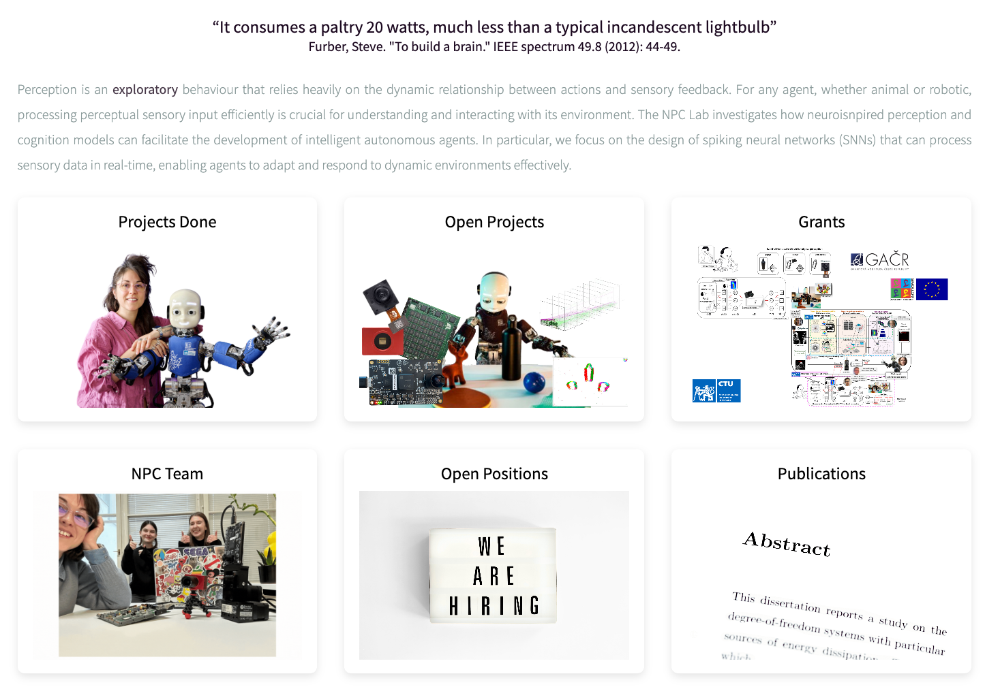

### Research Focus

| Theme | Description |
|---|---|
| **Event-based vision** | Processing asynchronous DVS data for real-time robotic perception |
| **Neuromorphic computing** | Deployment of brain-inspired algorithms on dedicated hardware (SpiNNaker, Loihi, Innatera Pulsar, Speck) |
| **Spiking Neural Networks** | Biologically plausible models for efficient, spike-based computation |
| **Active vision** | Bio-inspired eye movement control for humanoid robots (iCub) |
| **Embodiment** | Integration of neuromorphic sensing and computing into physical robotic bodies to enable adaptive, real-world behaviour |

### Selected Lab Output

> 📄 **NMI Perspective Paper (2026)**  
> *"A benchmarking framework for embodied neuromorphic agents"*  
> **Nature Machine Intelligence** — DOI: [10.1038/s42256-026-01197-w](https://doi.org/10.1038/s42256-026-01197-w)  
> Open-source platform: [github.com/ActiveBraid/ActiveBraidCrawler](https://github.com/ActiveBraid/ActiveBraidCrawler)

The lab is an active member of the **Open Neuromorphic** community and runs the [**Brains & Machines**](https://brainsandmachines.net/) podcast — a forum for researchers at the intersection of neuroscience, robotics, and AI.

---

## 📖 Introduction

Robotics is entering a new era of intelligence. Traditional approaches to perception and computation are no longer sufficient to meet the demands of real-time, energy-efficient, and adaptive autonomous systems.

**Event-driven sensing** and **neuromorphic computing** offer disruptive solutions to these challenges by mimicking the way biological brains perceive and process their surroundings. Unlike conventional systems that process data at fixed intervals, event-driven systems react *only when a change occurs* in the environment, just like biological sensory neurons.

```
Traditional camera:          Event-based camera:
┌────────────────────┐       ┌────────────────────┐
│ Frame @ t=0ms      │       │ Event at (x,y,t,p) │
│ Frame @ t=33ms     │  vs.  │ Event at (x,y,t,p) │
│ Frame @ t=66ms     │       │ Event at (x,y,t,p) │
│ (full image always)│       │ (only on change)   │
└────────────────────┘       └────────────────────┘
     High redundancy              Low latency
     Fixed rate                   Asynchronous
     High power                   Energy efficient
```

This shift enables **low-latency**, **low-power**, and **highly efficient** processing — essential for autonomous robots, smart city infrastructure, and space exploration, where quick adaptation and energy efficiency are paramount.

Event-based sensing spans multiple modalities, including [vision](https://www.prophesee.ai/event-based-sensor-imx636-sony-prophesee/), [audio](https://link.springer.com/referenceworkentry/10.1007/978-1-4614-7320-6_118-1), and [touch](https://link.springer.com/referenceworkentry/10.1007/978-981-16-5540-1_117), and integrates naturally with neuromorphic computing platforms such as [SpiNNaker](https://www.humanbrainproject.eu/en/collaborate-hbp/innovation-industry/technology-catalogue/spinnaker/), [Speck](https://www.synsense.ai/products/speck-2/), [Loihi](https://www.intel.com/content/www/us/en/research/neuromorphic-computing.html), [BrainScaleS](https://brainscales.kip.uni-heidelberg.de/), and [Akida](https://brainchip.com/akida-neural-processor-soc/).

---

## 🏛️ A Brief History of Neuromorphic Engineering

The story of neuromorphic engineering begins in the late 1980s at Caltech, with a simple but radical idea: *what if we built circuits that think like neurons?*

---

### Carver Mead — The Founder

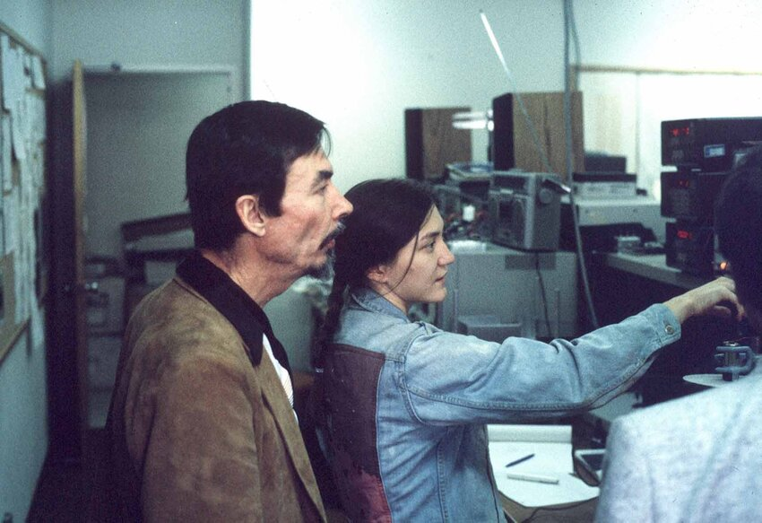

[Carver Mead](http://www.carvermead.caltech.edu/), Professor Emeritus at Caltech, is widely recognised as the founder of neuromorphic engineering. In the late 1980s, he introduced the concept of using **analog VLSI circuits** to mimic the neuro-biological architectures of the nervous system.

His seminal work *A Silicon Model of Early Visual Processing*, co-authored with Misha Mahowald in 1988, demonstrated the potential of silicon-based neural systems. In 2024, Mead was honoured with a lifetime contribution award by the Misha Mahowald Prize committee.

[📰 Read more at Caltech](https://www.caltech.edu/about/news/carver-mead-earns-lifetime-contribution-award-for-neuromorphic-engineering/)

[](https://www.youtube.com/watch?v=vznthE_AsVM)

---

### Misha Mahowald — The Silicon Retina

[Misha Mahowald](https://direct.mit.edu/neco/article/35/3/343/113812/Neuromorphic-Engineering-In-Memory-of-Misha), one of Mead's doctoral students, developed the **first silicon retina** — an analog VLSI system that emulated the early visual processing of the human retina. Her groundbreaking work in the early 1990s on a silicon model of stereoscopic vision laid the foundation for all future neuromorphic vision systems.

The **Misha Mahowald Prize** was established in her honour to recognise outstanding achievements in neuromorphic engineering.

[](https://www.youtube.com/watch?v=dh8O5PuxyTk)

---

### Tobi Delbruck — Event-Based Cameras

[Tobi Delbruck](https://www.eetimes.com/podcasts/tobi-delbruck-talks-caltech-cameras-and-neural-control/), Professor at the Institute of Neuroinformatics (INI), University of Zurich & ETH Zurich, has been central to advancing event-based vision sensors. Collaborating with Mead and Mahowald, he shaped the design of modern low-latency, low-power DVS cameras.

[](https://www.youtube.com/watch?v=Y1KBAFM1Iuc)

---

### Giacomo Indiveri — Neuromorphic Chips

[Giacomo Indiveri](https://ee.ethz.ch/the-department/people-a-z/person-detail.Nzk0NzU=.TGlzdC8zMjc5LC0xNjUwNTg5ODIw.html), Professor at INI Zurich/ETH, is a prominent figure in the development of bio-inspired computational architectures. His research focuses on hardware that mimics the brain's neural processes — particularly in real-time sensory processing — with direct implications for robotics and AI.

[](https://www.youtube.com/watch?v=eTbd8JXcf3Y&ab_channel=UCBerkeleyEvents)


## 📷 What Are Event-Based Cameras?

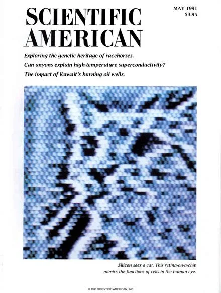

You can come and see the original silicon retina paper by Misha Mahowald at the NPC Lab — it is framed on the wall!
Unlike traditional cameras that capture full frames at fixed intervals (e.g. 30 or 60 fps), **event-based cameras** operate on a fundamentally different principle.

> **Each pixel is independent.** When a pixel detects a change in brightness — due to motion, lighting shifts, or other factors — it fires an **event** immediately. Static regions generate no data at all.

Each event encodes four pieces of information:

```
Event = (x, y, t, p)
         │  │  │  └─ polarity: ON (increment of light) or OFF (decrement of light)
         │  │  └──── timestamp (microsecond resolution)
         │  └─────── pixel column
         └────────── pixel row
```

### Key Properties

| Property | Traditional Camera | Event-Based Camera |
|---|---|---|
| Temporal resolution | ~ms (frame rate) | ~μs (per event) |
| Dynamic range | ~60 dB | >120 dB |
| Data redundancy | High (full frame) | Low (changes only) |
| Power consumption | High | Very low |
| Motion blur | Present | Absent |
| Latency | Frame interval | ~1 μs |

  
*Copyright: Arren Glover, Italian Institute of Technology*

Event-based cameras mimic the initial layers of the mammalian retina, reacting to pixel-level illumination changes asynchronously [1]. This results in significant data reduction, making them highly relevant for robotic applications [2,3,4,5] — particularly for guiding visual attention and active perception.

---

## 🎙️ Go Deeper: Brains & Machines Podcast

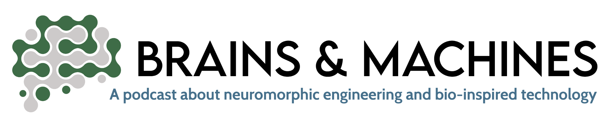

Want to hear directly from the researchers shaping this field? Check out the [**Brains & Machines**](https://brainsandmachines.net/) podcast, where [Assistant Professor Giulia D'Angelo](https://www.giuliadangelo.com/) is the co-founder and co-content creator; episodes feature leading experts in neuromorphic engineering, event-based vision, and brain-inspired AI.


---

## 📑 Lecture Slides

Full lecture slides: [CTU — Neuromorphic Sensing and Computing](https://campuscvut-my.sharepoint.com/:p:/g/personal/dangegiu_cvut_cz/IQBL2wrna3ocSqEVB-bG0LNMARzoThHMUDOr4k2heRWEOJc?e=c3r1oU)

---

## 📋 Google Form — Tutorial Responses

#### NEUROINFORMATICS: Please submit your tutorial answers here: [Google Form](https://docs.google.com/forms/d/e/1FAIpQLSdHDWT7G6PXqij7RC-u5i5JShtmrDN7Okj_UKvkxoKJ2X0xDw/viewform?usp=dialog)

#### HUMANOIDS: Please submit your tutorial answers here: [Google Form](https://docs.google.com/forms/d/e/1FAIpQLSd8JCusPWwxqly_jD44oR1SI4IQp-HCF0QWYhSivc1Adr7LCA/viewform?usp=publish-editor) 

## 🗂️ Tutorial Overview

The tutorials below are organised in increasing complexity — from raw event data visualisation to full spiking neural network pipelines. Each tutorial builds on the previous one.

```
Tutorial 1A → 1B → 1C    Event data: time window → sliding window → fixed count
Tutorial 2                DVS Gesture Dataset
Tutorial 3A → 3B          Single neuron simulation (LIF model)
Tutorial 4                Spiking Neural Networks (Brian)
Tutorial 5                SNN Visual Attention
Tutorial 6                Log-Polar Retinal Structure
Tutorial 7                SNN Object Motion Sensitivity
```


### Getting Started:


**COLAB version of the Tutorials:** [__Google Drive__](https://drive.google.com/drive/folders/1JoURbf9NlDCHOHK3PIJ9Q1FS1pvaAvNs?usp=sharing)


```
1. Clone the repository
git clone https://github.com/GiuliaDAngelo/CTU-EDNeuromorphic.git
cd CTU-EDNeuromorphic

2. Create a virtual environment
python -m venv .venv

Activate it:
macOS/Linux:
source .venv/bin/activate
Windows:
.venv\Scripts\activate

3. Install dependencies
pip install -r requirements.txt

4. Download tutorial data
- Tutorial 5 — place in data/twoobjects/:
https://www.dropbox.com/scl/fi/bt7l382p1b7ouau5x07tb/twoobjects.npy

- Tutorial 7 — place in data/evimo/:
https://www.dropbox.com/scl/fo/g5j17yh6elrc61s66aiba/AO2lSvWa5oLlZYhc0V2CNkw

5. Start with your tutorial session: 
python Tutorial1A-EventBasedDataTimeWindow.py

```


### Tutorial 1A — Time Window for Event-Based Data Visualisation

**Script:** [`Tutorial1A-EventBasedDataTimeWindow.py`](Tutorial1A-EventBasedDataTimeWindow.py)

**Excercise:** [`Tutorial1A_Exercise.py`](Tutorial1A_Exercise.py)

This script introduces event-based data loading and visualisation using the `importIitYarp` function from the **Bimvee** library. Events are processed within **fixed time windows** and displayed dynamically in real time using OpenCV.

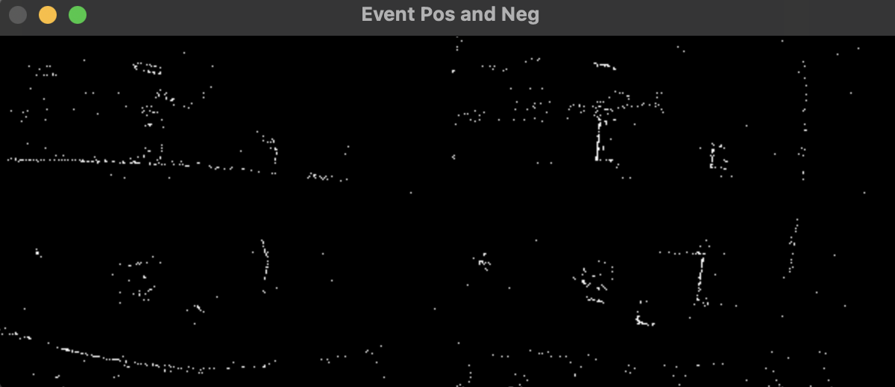

> 💡 **Key concept:** A fixed time window captures all events that occur within a defined interval [t, t+Δt]. This is the simplest way to batch asynchronous events for visualisation or processing.

**Question:**

1. How do event cameras differ from traditional frame-based cameras, and what advantages do they provide?

**Optional Questions for Brainstorming:**

2. How might the four event attributes (x, y, t, polarity) be useful for understanding object motion? 

3. How does adjusting the time window period affect visualisation? 

---

### Tutorial 1B — Sliding Window for Event-Based Data Visualisation

**Script:** [`Tutorial1B-EventBasedDataSlidingWindow.py`](Tutorial1B-EventBasedDataSlidingWindow.py)

This script extends the time-window approach with a **sliding window** that continuously updates: old events are removed as new ones arrive, providing a smoothly evolving view of the scene. ON and OFF events are tracked separately.

> 💡 **Key concept:** A sliding window preserves temporal continuity. Unlike the fixed window, it never "resets" — it shifts forward, always showing the most recent Δt of activity.

**Question:** 

1. What happens if `sliding_wdw` equals `initial_window_period`?

**Optional Question:** 

2. In a scene where nothing is moving, how many events would a fixed-count window generate compared to a time-based window? Explain why.
---

### Tutorial 1C — Fixed Event Count for Event-Based Data Visualisation

**Script:** [`Tutorial1C-EventBasedDataNumberEvents.py`](Tutorial1C-EventBasedDataNumberEvents.py)

Instead of a time-based window, this script processes a **fixed number of events** per visualisation cycle, ensuring a consistent sampling rate regardless of scene activity.

> 💡 **Key concept:** In low-activity scenes, a fixed event count window covers a longer time span; in high-activity scenes, it covers a shorter one. This is useful when downstream processing (e.g. a neural network) expects a fixed-size input.

**Question:** 

1. If you increase `num_events` from 100 to 1000, what do you see in the visualisation and why?

---

### Tutorial 2 — Loading the IBM DVS Gesture Dataset

**Script:** [`Tutorial2-EventBasedData.py`](Tutorial2-EventBasedData.py)

This tutorial explores the **DVSGesture dataset** — a standard benchmark in neuromorphic vision. The script converts event streams into frames representing positive and negative polarities, displayed side by side for a comprehensive view of the sensor's response.

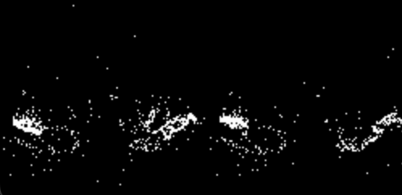

> 💡 **Key concept:** The DVSGesture dataset contains 11 hand gesture classes recorded under different lighting conditions. It is widely used to benchmark event-based classification algorithms.

**Exercise -> TODO: compute the total number of events and the sparsity for the specific user_trial (Humanoids, number)**

**Question:**

1. Try experimenting with different values for **user_trial** (Humanoids **number**) and **time_window**. How do these changes affect the visualization and interpretation of the data?


### Tutorial 3A — Play with Neurons (LIF Model)

**Script:** [`Tutorial3A-Neuron.py`](Tutorial3A-Neuron.py)

This script simulates a **Leaky Integrate-and-Fire (LIF)** neuron — the most widely used model in computational neuroscience. The membrane potential is visualised dynamically in response to external input current pulses.

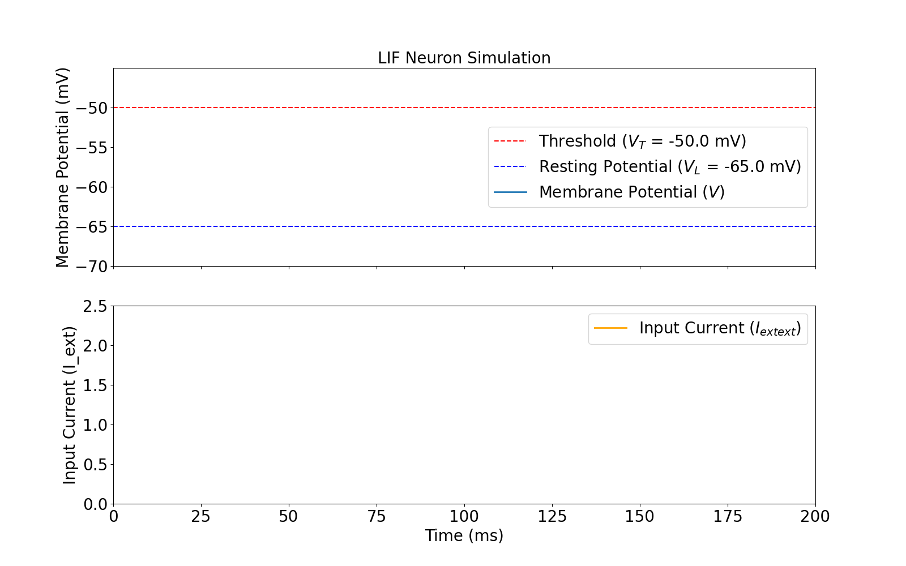

> 💡 **Key concept:** The LIF model captures the essential dynamics of biological neurons: integrate incoming charge, leak over time, fire when a threshold is reached, then reset. It is computationally simple yet biologically meaningful.

```
dV/dt = (-(V - V_rest) + R·I(t)) / τ_m

If V ≥ V_threshold  →  spike emitted, V reset to V_rest
```

**Question:**

1. Find the minimal constant current  𝐼𝑚𝑖𝑛  which causes the neuron to fire at least once.

**Optional Questions:**
1. How does changing the amplitude and duration of input current pulses affect the neuron's firing behaviour?
2. What happens when you modify LIF parameters such as `Cm`, `gL`, or `VT`? Can you identify the role of each parameter?
3. Can you introduce additional input pulses to produce a different firing rate? What does this represent biologically?

---

### Tutorial 3A — Play with the refractory period

**Script:** [`Tutorial3A-Neurons_refractory.py`](Tutorial3A-Neurons_refractory.py)

**Questions:**

1. What is the difference in the spike rates with and without refractory period for  𝐼𝑒𝑥𝑡=18   𝜇𝐴 ?
---

### Tutorial 3B — Play with the Sinabs Library

**Script:** [`Tutorial3B-Neuron_sinabs.py`](Tutorial3B-Neuron_sinabs.py)

This script uses the **Sinabs** library to simulate a single LIF neuron with injected current, based on the [Sinabs documentation](https://sinabs.ai/).

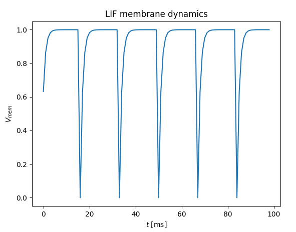

**Question:**

1. How many times did each of the four neurons spike within the simulation window?

**Optional Questions:**
1. How does the membrane time constant (`tau_mem`) affect the neuron's membrane potential dynamics?
2. What role does `torch.no_grad()` play in the simulation, and why is it used?

---

### Tutorial 4 A & B — Play with Spiking Neural Networks (Brian2)

**Script:** [`Tutorial4A-SpikingNeuralNetwork.py`](Tutorial4A-SpikingNeuralNetwork.py)

**Script:** [`Tutorial4B-SpikingNeuralNetwork.py`](Tutorial4B-SpikingNeuralNetwork.py)

This tutorial introduces **network-level** spiking dynamics using the **Brian2** simulator. A population of LIF neurons is defined with governing equations, thresholds, resets, and refractory periods. Network activity is recorded and visualised.

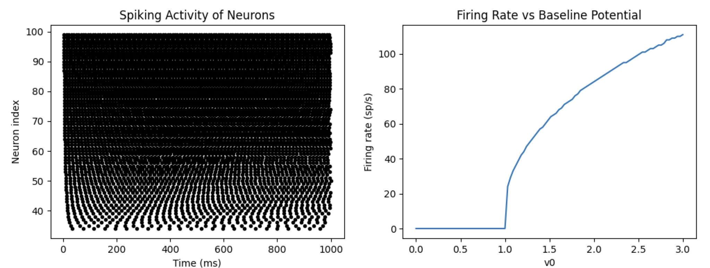

> 💡 **Key concept:** Real neural computation emerges at the *network* level — not from individual neurons. This tutorial demonstrates how collective spiking patterns arise from population dynamics, which underpins everything from sensory coding to decision-making.

**Questions:**

1. 4B) Set weights back to w = 1.0 and start decreasing the refractory period from 5*ms down to 1*ms. How far does the signal spread for 1*ms refractory period?

### Tutorial 5 A & B — SNN Visual Attention

**Script:** [`Tutorial5A-EventBasedSNNVisualAttention.py`](Tutorial5A-EventBasedSNNVisualAttention.py)

**Script:** [`Tutorial5B-VisualAttentionInhibition.py`](Tutorial5B-VisualAttentionInhibition.py)

📥 **Download data:** [twoobjects.npy](https://www.dropbox.com/scl/fi/bt7l382p1b7ouau5x07tb/twoobjects.npy?rlkey=w33wyjx3jme95eimjg6srw6u7&st=c99r18fz&dl=0)

This tutorial implements a **saliency-based attention mechanism** using event-driven data. A saliency map is generated dynamically, highlighting areas of interest in a scene with two moving objects. The pipeline uses PyTorch for computation and OpenCV for real-time display.

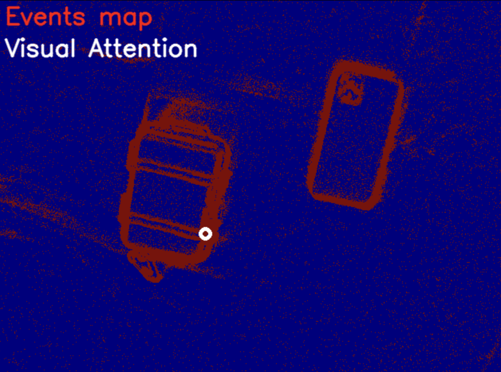

> 💡 **Key concept:** This tutorial connects directly to the NPC Lab's research on **active vision for robotics** — the idea that a robot should not process everything equally, but focus its limited resources on the most behaviourally relevant parts of the scene.


**Exercise:**  

     # TODO: Here use the run_attention_inhibition_of_return(window, net_attention, device, resolution,
        #                                   config.ATTENTION_PARAMS['num_pyr'], visited_locations)
        #      function instead of run_attention()
        # saliency_map[:], salmax_coords[:] = HERE

**Questions:**
1. What are the coordinates of the first three detected most salient points when the inhibition of return is active?

---

### Tutorial 6 — Log-Polar Retinal Structure

**Script:** [`Tutorial6-LogPolarRetina.py`](Tutorial6-LogPolarRetina.py)

This tutorial builds a biologically plausible **retina model with eccentric receptive fields**, replicating the log-polar spatial organisation of the mammalian fovea. A Look-Up Table (LUT) is constructed to accelerate event-to-neuron mapping.


> 💡 **Key concept:** The human retina does not sample space uniformly — it is highly precise at the fovea (centre) and coarser in the periphery. This log-polar structure is enormously efficient and is the biological motivation for foveated active vision systems.

**Reference:** Chessa et al., *A space-variant model for motion interpretation across the visual field*, Journal of Vision, 2016. [DOI](https://jov.arvojournals.org/article.aspx?articleid=2498961)

**Exercise 1:**  
     ### TODO 1: Compute image coverage from the LUT mask.
     ###         A pixel is covered if mask[y][x] contains at least one neuron ID.
     ###         Hint: loop over all (y, x) and check len(mask[y][x]) > 0

**Exercise 2:**  
     ### TODO 2: Create a diagonal stimulus (top-left → bottom-right).
     ###         For each pixel (t, t) along the diagonal, find all neurons in mask[t][t]
     ###         and collect their IDs into a sorted list.
     ###         Hint: diag_len = min(width, height), then loop t in range(diag_len)
     

**Optional Questions:**
1. How does the `rescale_rho` function ensure that receptive fields are properly distributed within plot dimensions? What is the role of the nonlinearity parameter `a`?
2. What role does the `gaussian_plot` function play in visualising receptive fields, and how does it relate to membrane potential dynamics and spike generation?

---

### Tutorial 7 — SNN Object Motion Sensitivity

**Script:** [`Tutorial7-OMS.py`](Tutorial7-OMS.py)

📥 **Download data:** [Dropbox link](https://www.dropbox.com/scl/fo/g5j17yh6elrc61s66aiba/AO2lSvWa5oLlZYhc0V2CNkw?rlkey=w0hgpsbd2mjvbfp4vrtdm5bhe&st=hi09k9to&dl=0)

This tutorial implements an **Object Motion Sensitivity (OMS)** network — a biologically inspired mechanism for motion segmentation. The system analyses event-based frames using centre-surround spatial kernels to detect *local* motion differences, producing a motion segmentation map comparable with ground-truth masks.

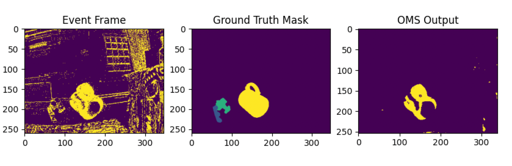

> 💡 **Key concept:** OMS cells are modelled on retinal ganglion cells that respond selectively to objects moving differently from their background. This is directly related to the NPC Lab's work on bioinspired visual attention — see [D'Angelo et al., arXiv:2502.06747, 2025](https://arxiv.org/abs/2502.06747).


**Exercise**

     # 5. Exercise: Compute OMS Motion Score
     # GOAL: Compute a numeric OMS motion score on one frame.
     # Expected Output:
     # - frame index (integer)
     # - motion ratio (%) in [0, 100]

**Questions:**
1. How does the difference between center and surround responses contribute to motion segmentation in the OMS network?

---

## 📚 References

1. Lichtsteiner, P., Posch, C., & Delbruck, T. (2008). A 128×128 120dB 15μs Latency Asynchronous Temporal Contrast Vision Sensor. *IEEE Journal of Solid-State Circuits*, 43(2), 566–576.
2. Monforte, M., et al. (2020). Exploiting event cameras for spatio-temporal prediction of fast-changing trajectories. *IEEE AICAS 2020*.
3. Mueggler, E., et al. (2018). Continuous-time visual-inertial odometry for event cameras. *IEEE Transactions on Robotics*, 34(6), 1425–1440.
4. Iacono, M., et al. (2018). Towards event-driven object detection with off-the-shelf deep learning. *IEEE/RSJ IROS 2018*.
5. Glover, A., & Bartolozzi, C. (2017). Robust visual tracking with a freely-moving event camera. *IEEE/RSJ IROS 2017*.
6. Bartolozzi, C., et al. (2011). Embedded neuromorphic vision for humanoid robots. *CVPR Workshops 2011*.
7. D'Angelo, G., et al. (2025). Wandering around: A bioinspired approach to visual attention through object motion sensitivity. *arXiv:2502.06747*.
8. D'Angelo, G., et al. (2026). A benchmarking framework for embodied neuromorphic agents. *Nature Machine Intelligence*. DOI: 10.1038/s42256-026-01197-w.

---

*NPC Lab — Czech Technical University in Prague | Faculty of Electrical Engineering | Department of Cybernetics*  
*Contact: [giulia.dangelo@fel.cvut.cz](mailto:giulia.dangelo@fel.cvut.cz)*
